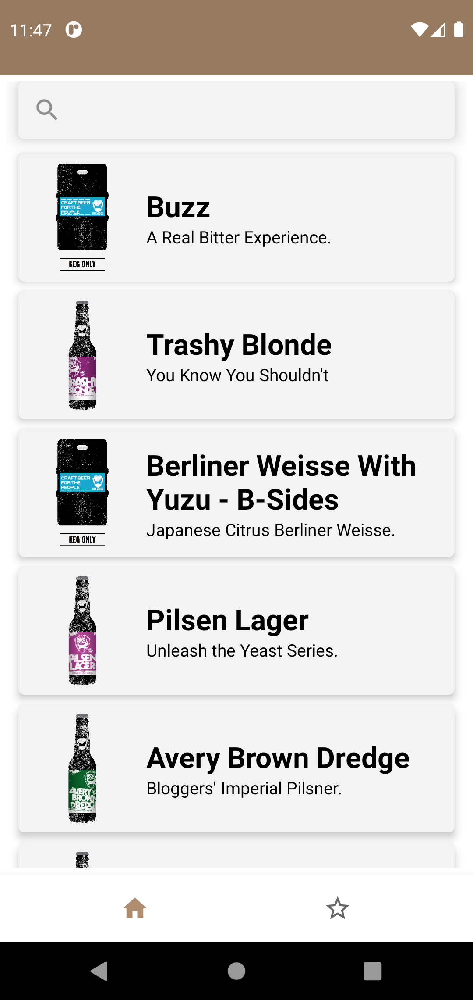
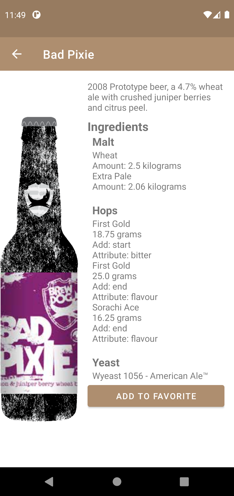
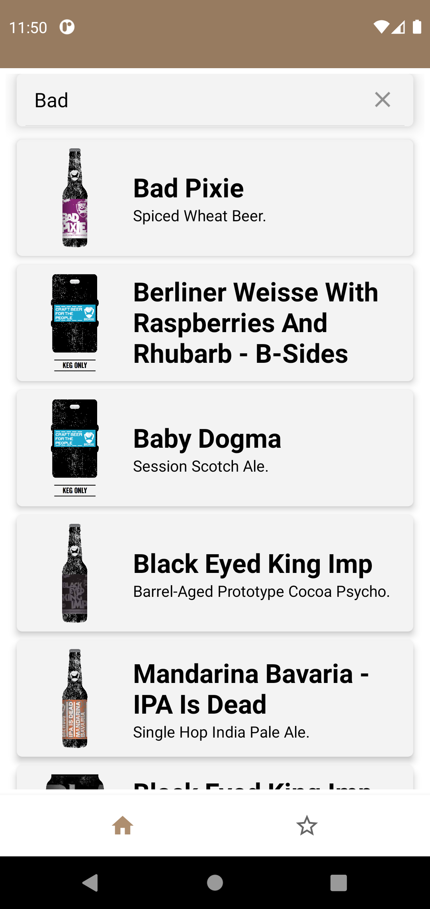
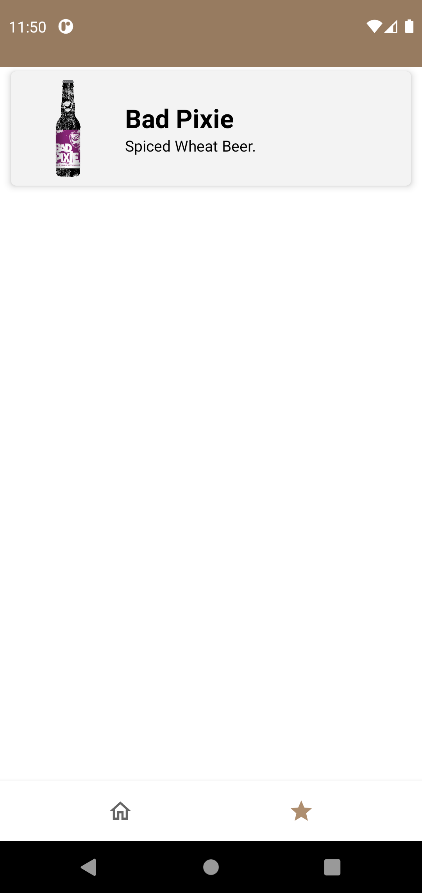
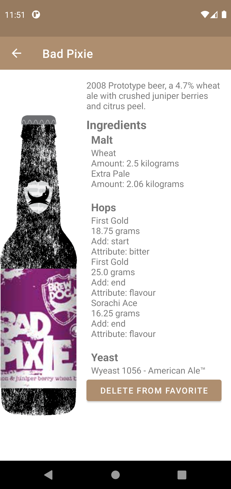

# Cervejeiros_SA_Kotlin_MVVM
Remake of the Cervejeiros_SA project, using Kotlin and MVVM architeture

    

## Built with:
* Kotlin - Programming Language
* Retrofit - Used to consume API 
* [PUNKAPI](https://punkapi.com/documentation/v2) - API that provided beer info
